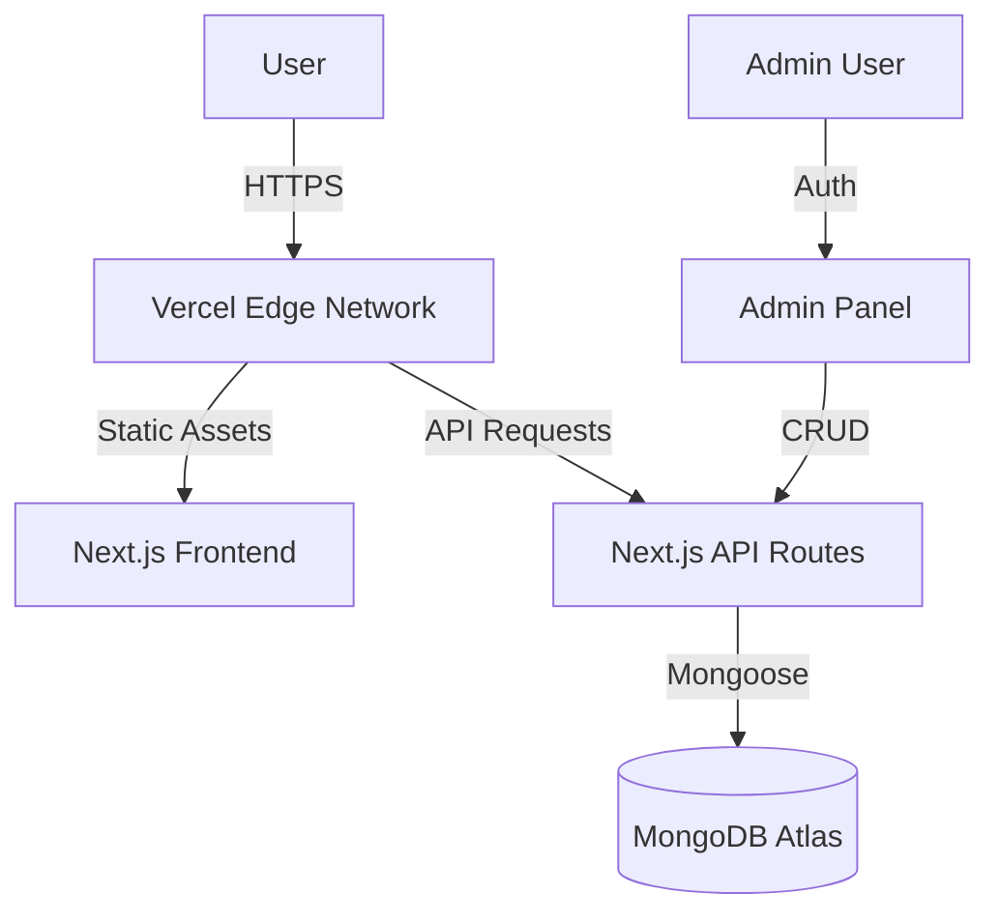

# 🚀 Next.js Portfolio with MongoDB 

> A high-performance, full-stack portfolio application built with Next.js 14, MongoDB, and Tailwind CSS. Designed for scalability, SEO, and interactive user experiences.

[](https://vercel.com/new/clone?repository-url=https%3A%2F%2Fgithub.com%2Fyourusername%2Fyour-repo)
[](https://opensource.org/licenses/MIT)
[](https://nextjs.org/)
[](https://www.mongodb.com/)

## 📖 Overview

This project is more than just a static portfolio; it's a **full-stack application** that demonstrates modern web development practices. It features a custom **Admin Dashboard** for content management, **dynamic SEO** generation, and **serverless API** integration.

### Key Features

-   **⚡ High Performance**: Built on Next.js App Router with Server Components.
-   **🛠 Admin Panel**: Custom dashboard to manage Projects, Blogs, and Certificates without code changes.
-   **🔍 Advanced SEO**: Dynamic sitemap, robots.txt, JSON-LD structured data, and Open Graph tags.
-   **🎨 Modern UI**: Glassmorphism design, Framer Motion animations, and responsive layouts.
-   **💾 Full Stack**: MongoDB backend for dynamic data persistence.
-   **📱 Mobile First**: Fully responsive design optimized for all devices.

## 🏗 Architecture

The application follows a modern **Serverless Architecture** deployed on Vercel.



## 🛠 Tech Stack

-   **Frontend**: Next.js 14, React 18, Tailwind CSS, Framer Motion
-   **Backend**: Next.js API Routes (Serverless Functions)
-   **Database**: MongoDB (Mongoose ODM)
-   **Styling**: Tailwind CSS, Lucide React (Icons)
-   **Deployment**: Vercel

## 🚀 Getting Started

### Prerequisites

-   Node.js 18+
-   MongoDB Atlas Account

### Installation

1.  **Clone the repository**:
    ```bash
    git clone https://github.com/yourusername/your-repo.git
    cd your-repo
    ```

2.  **Install dependencies**:
    ```bash
    npm install
    ```

3.  **Configure Environment**:
    Create a `.env.local` file in the root directory:
    ```env
    MONGO_URI=mongodb+srv://<user>:<pass>@cluster.mongodb.net/nextportfolio
    NEXT_PUBLIC_BASE_URL=http://localhost:3000
    ```

4.  **Run Development Server**:
    ```bash
    npm run dev
    ```

    Visit [http://localhost:3000](http://localhost:3000) to see the app.

## 📂 Project Structure

```
src/
├── app/
│   ├── (site)/       # Public facing pages (Home, About, etc.)
│   ├── admin/        # Protected Admin Dashboard
│   ├── api/          # Backend API Routes
│   ├── layout.js     # Root Layout & SEO Config
│   └── ...
├── components/       # Reusable UI Components
├── lib/              # Utility functions
└── ...
```

## 🚢 Deployment

For detailed deployment instructions, please refer to [DEPLOYMENT.md](./DEPLOYMENT.md).

## 🤝 Contributing

Contributions are welcome! Please feel free to submit a Pull Request.

## 📄 License

This project is licensed under the MIT License.
